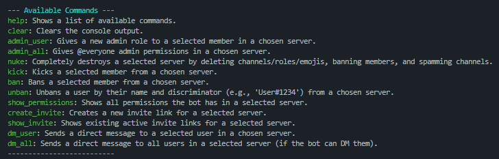

> [!NOTE]
> ✨ 2.0 is in beta, report bugs through the issues tab. ✨

# 🦈 Mako Takeover 🦈

## 📰 Description

Mako Takeover is a Discord bot takeover tool meant for causing chaos and destroying servers

## 💻 Features/Commands

## 🔧 WIP Features/Commands
<ul>
  <li>Nuke command settings</li>
  <li>Enhanced admin user command (change the permission of a role you have instead of making a new role)</li>
  <li>Want a new feature? Suggest one!</li>
</ul>

# 📝 Setup & Installation Guide

Everything you need to setup mako takeover is below (if your still having issues, join my discord server link in github bio)

<a href="https://github.com/Memerip/Mako-Takeover/blob/main/setup.txt">View guide</a> (slightly outdated)
